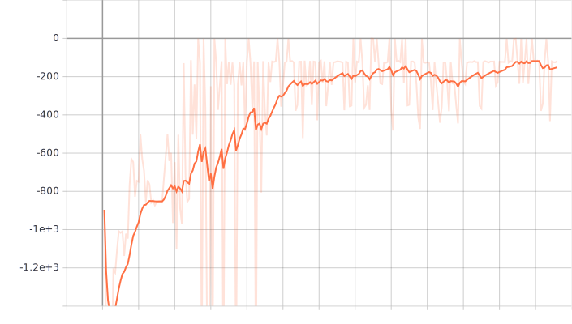
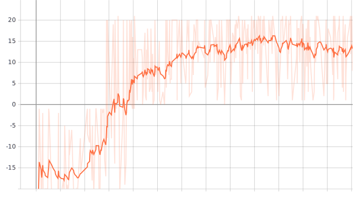
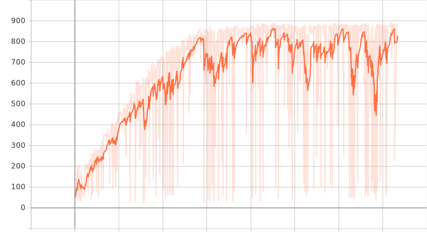

> **Caution 1**: Code is under active development. Breaking changes are probable.
>
> **Caution 2**: Documentation is lagging behind the code development.

[](https://digideep.readthedocs.io/en/latest/?badge=latest)

# Digideep

## Introduction

Digideep provides a framework for deep reinforcement learning research. Digideep's focus is on code **MODULARITY** and **REUSABILITY**.

**Specifications**:

* Compatible with [OpenAI Gym](https://github.com/openai/gym) and [Deepmind dm_control](https://github.com/deepmind/dm_control).
* [PyTorch](https://pytorch.org/) for modeling neural networks.
* Three RL methods already implemented: [DDPG](https://arxiv.org/abs/1509.02971), [SAC](https://arxiv.org/abs/1801.01290), and [PPO](https://arxiv.org/abs/1707.06347).

See documentation at https://digideep.readthedocs.io/en/latest/.

## Usage

### Installation

Follow [instructions](https://digideep.readthedocs.io/en/latest/notes/01%20Installation.html).

### Running

* Start a training session based on a parameter file. Default parameter files are stored in `digideep/params`. Example:

```bash
# Running PPO on the 'PongNoFrameskip-v4' environment
python -m digideep.main --params digideep.params.atari_ppo

# Run with TensorBoard
python -m digideep.main --params digideep.params.atari_ppo --tensorboard
```

* Change a parameter in parameter file from command-line:

```bash
# Starting PPO training on 'DMCBenchCheetahRun-v0', instead.
python -m digideep.main --params digideep.params.mujoco_ppo --cpanel '{"model_name":"DMCBenchCheetahRun-v0"}'
```

> Any parameter specified in the `cpanel` section in the parameter file can be altered through command-line.

* Playing a trained policy from a checkpoint. Example:

```bash
python -m digideep.main --play --load-checkpoint "<path_to_checkpoint>"
```

* Visualizing an environment:

```bash
python -m digideep.environment.play --model "Pendulum-v0"
```

* Listing all available environments using a filter. Example:

```bash
python -m digideep.environment.play --list-include ".*"
```

See [usage notes](https://digideep.readthedocs.io/en/latest/notes/02%20Usage.html) for more detailed usage information.


### Sample Results

```bash
# Running "SAC" on the default "Pendulum" environment:
python -m digideep.main --params digideep.params.sac_params --tensorboard

# Running "PPO" on "PongNoFrameskip-v4" environment:
python3 -m digideep.main --params digideep.params.atari_ppo --tensorboard

# Running `PPO` on dm_control's `DMBenchCheetahRun-v0` environment:
python3 -m digideep.main --params digideep.params.mujoco_ppo --cpanel '{"model_name":"DMBenchCheetahRun-v0", "from_module":"digideep.environment.dmc2gym"}' --tensorboard

```


| Learning Graph           |  Trained Policy |
:-------------------------:|:-------------------------:
 | 
  | 
  | 


## Changelog

* **_2019-05-20_**: Added Soft Actor-Critic (SAC). Added full support for Dict observation spaces.
* **_2019-03-04_**: Digideep was launched.

## Contributions

Contributions are welcome. If you would like to contribute to Digideep consider [Pull Requests](https://github.com/sharif1093/digideep/pulls) and [Issues](https://github.com/sharif1093/digideep/issues) pages of the project.

## Citation

Please use the following BibTeX entry to cite this repository in your publications:

```bibtex
@misc{digideep19,
  author = {Sharif, Mohammadreza},
  title = {Digideep: A DeepRL pipeline for developers},
  year = {2019},
  publisher = {GitHub},
  journal = {GitHub repository},
  howpublished = {\url{https://github.com/sharif1093/digideep}},
}
```

## License

BSD 2-clause.

## Acknowledgement

I would like to appreciate authors of
[OpenAI baselines](https://github.com/openai/baselines), 
[pytorch-a2c-ppo-acktr](https://github.com/ikostrikov/pytorch-a2c-ppo-acktr),
[RL-Adventure-2](https://github.com/higgsfield/RL-Adventure-2), and
[RLkit](https://github.com/vitchyr/rlkit) projects.
